# Assignment 1 Testing File

Name(s): Nicholas Petrelli

## Question 1

Loki Link: [Github](https://github.com/COIS-WebDev/assn1-Nicholas-09785)

## Question 2

Loki Link: [First page](https://loki.trentu.ca/~nicholaspetrelli/3430/assn/Assn1/assn1-Nicholas-09785/start.php)

### Testing
## HTML is valid

# Play:
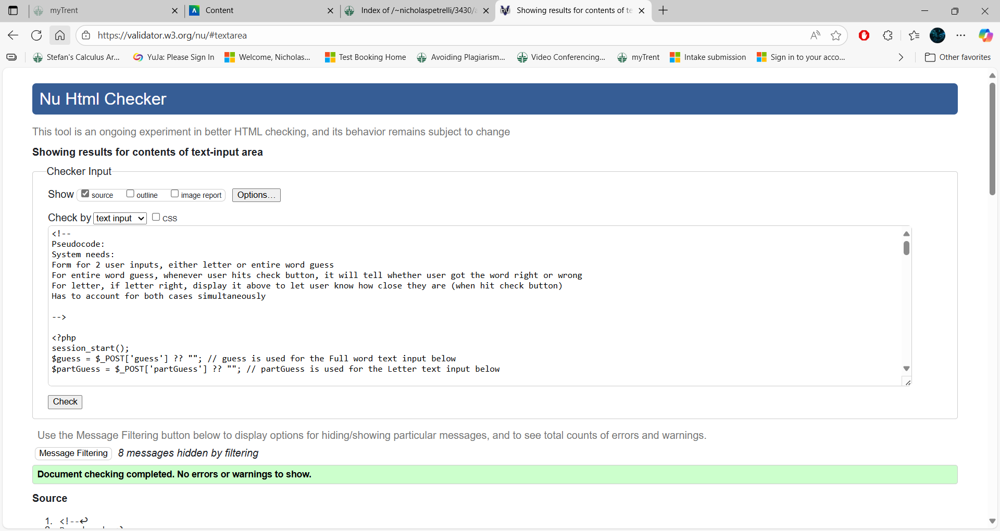

# Difficulty:
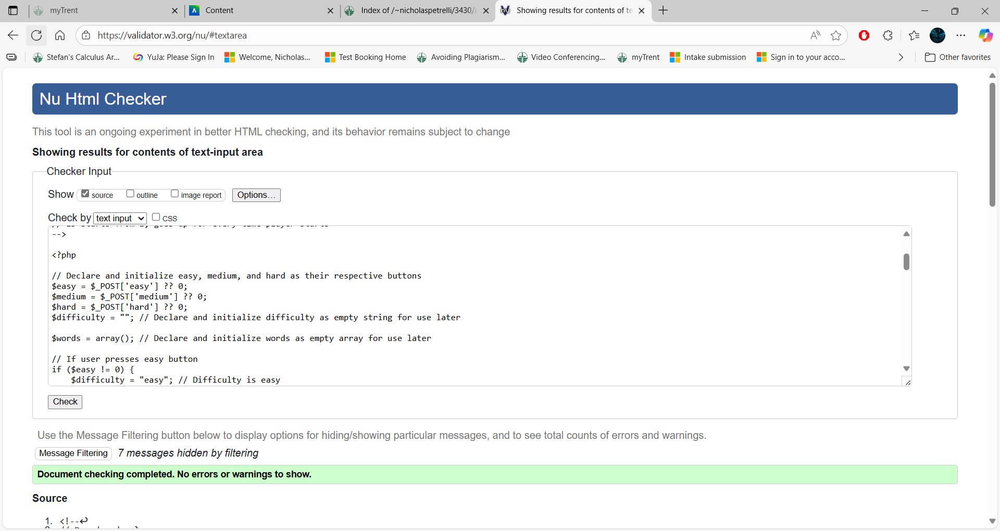

# Start:
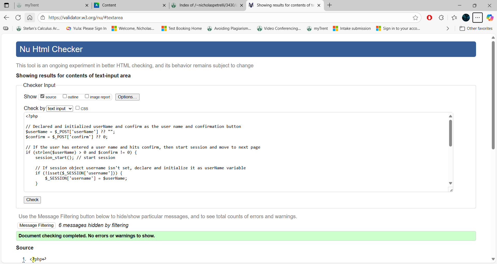

# Scores:
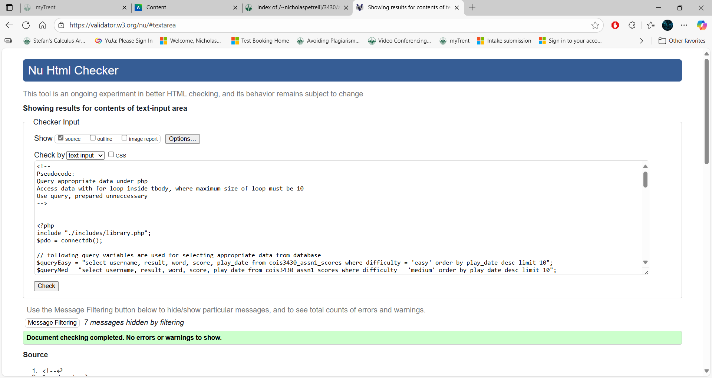

## Username correctly loads
# Username is expected to show correctly in a game of hangman, and for scoring:

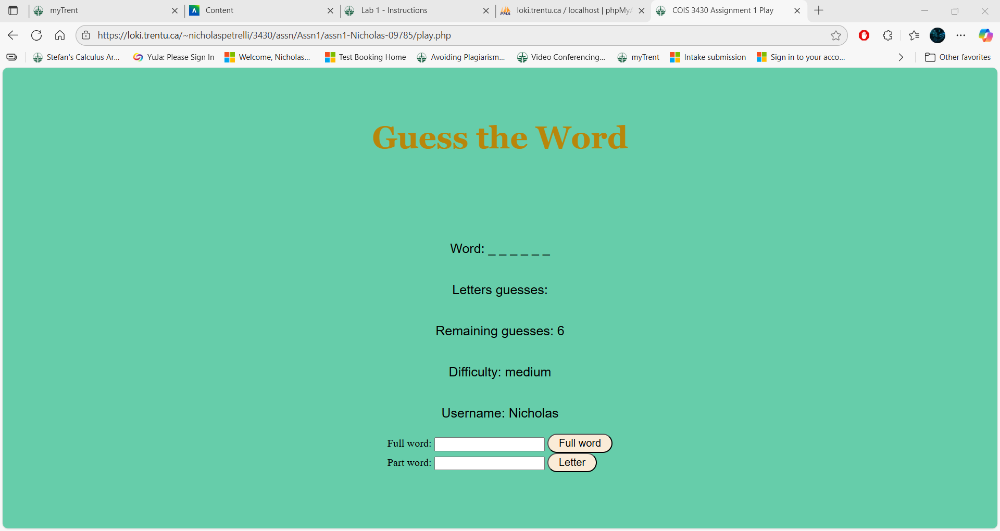

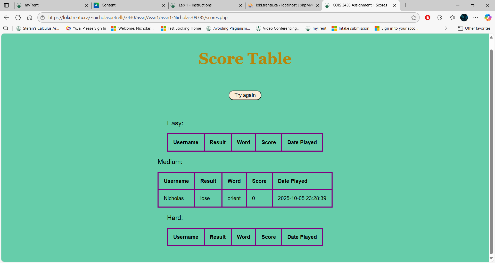

## Game of hangman works correctly
# Game of hangman is expected to work correctly whether a user has lost or won:
# Round lost:

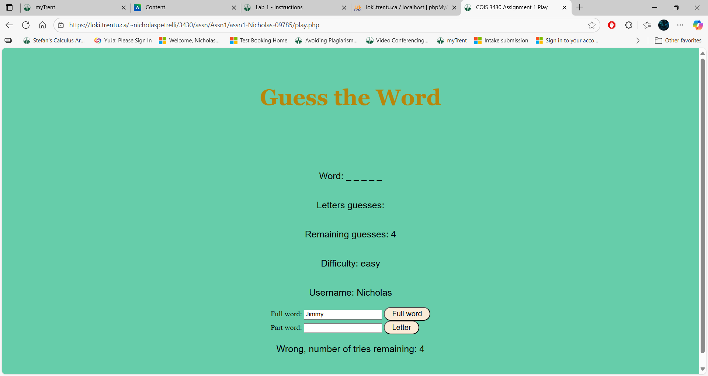

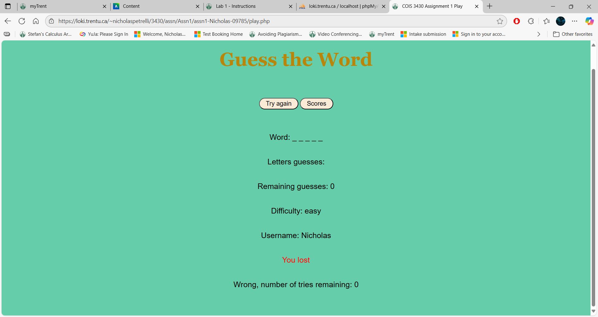

# Round won:
# After the second screen shot, it shows the word only for testing purposes

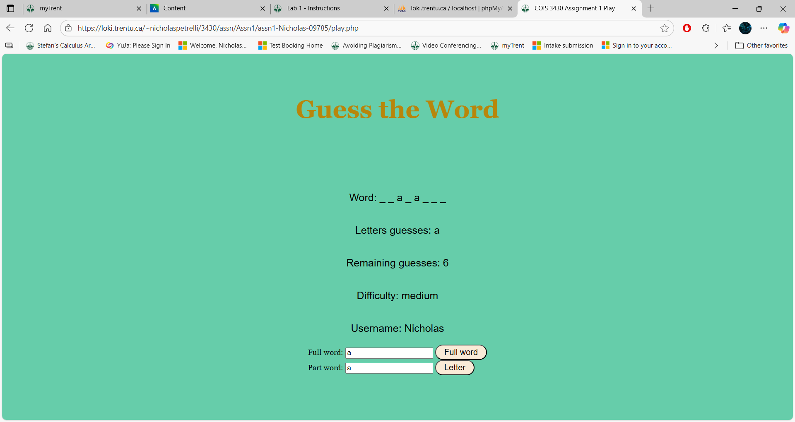

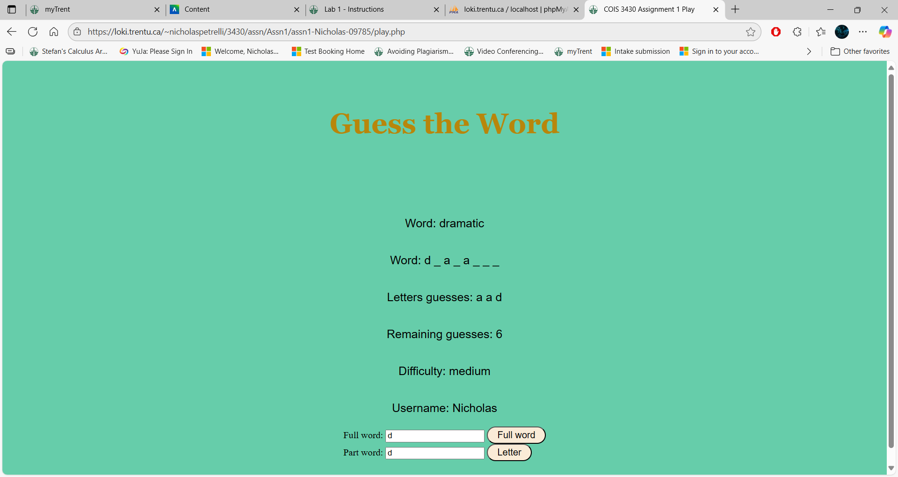

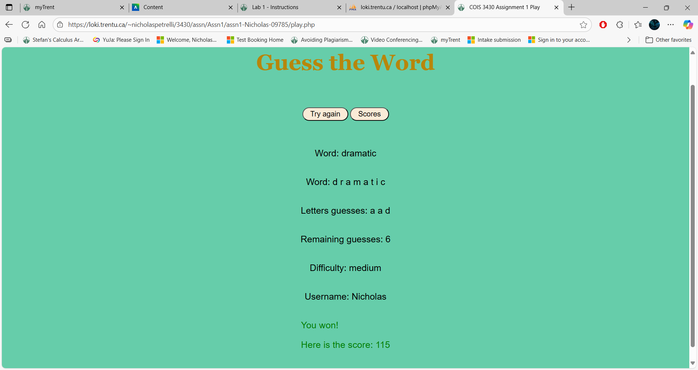

## Differentiates between difficulties
# Words selected on easy difficulties will show shorter words, whereas harder difficulties will show longer words to solve:

# Easy:

# Medium:
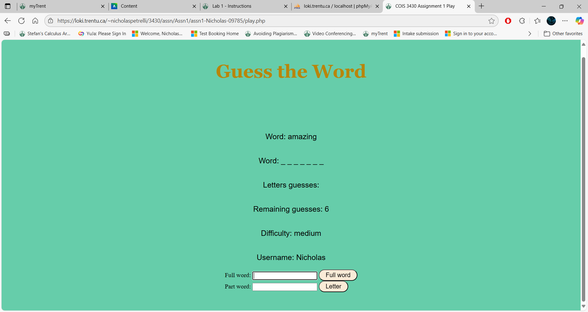

# Hard:
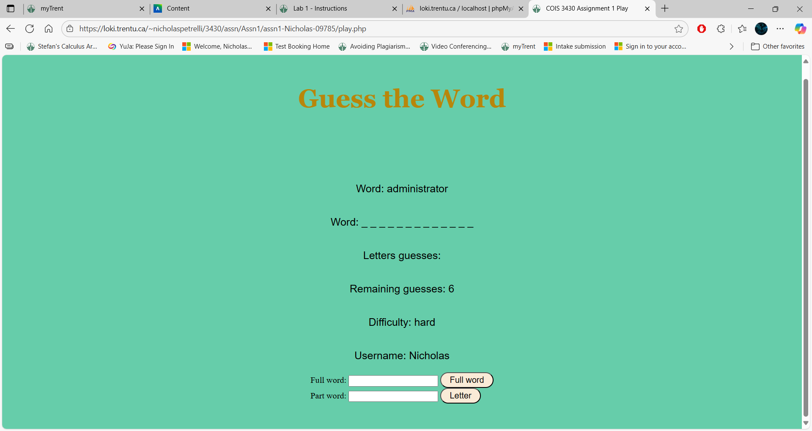

## Scores resets after more than 10 records
# Current scoreboard for medium:
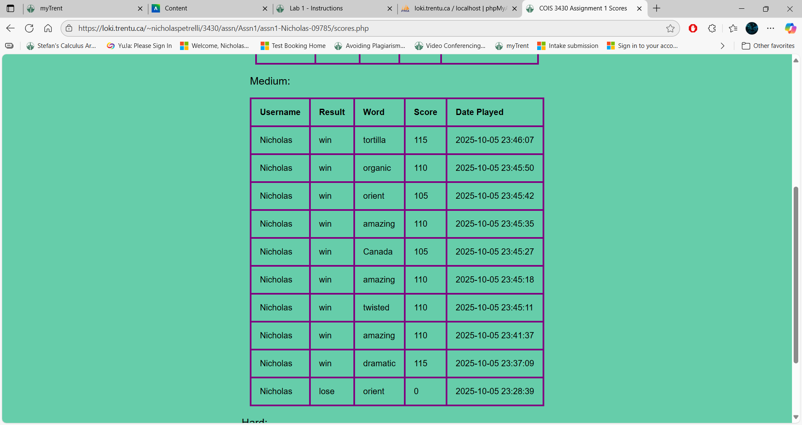

# Updated scoreboard for medium:
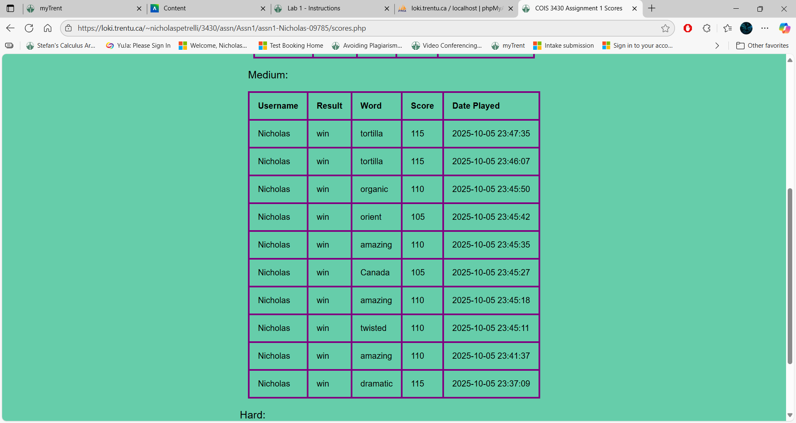

## Ignores capital
# Input:
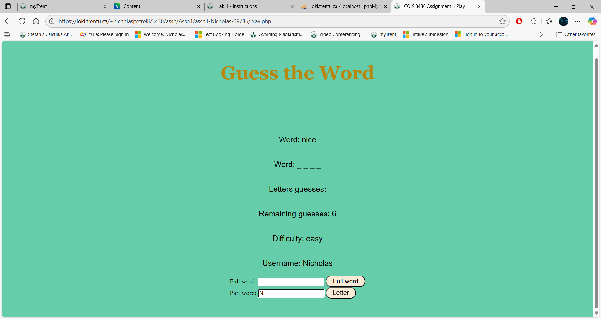

# Output:
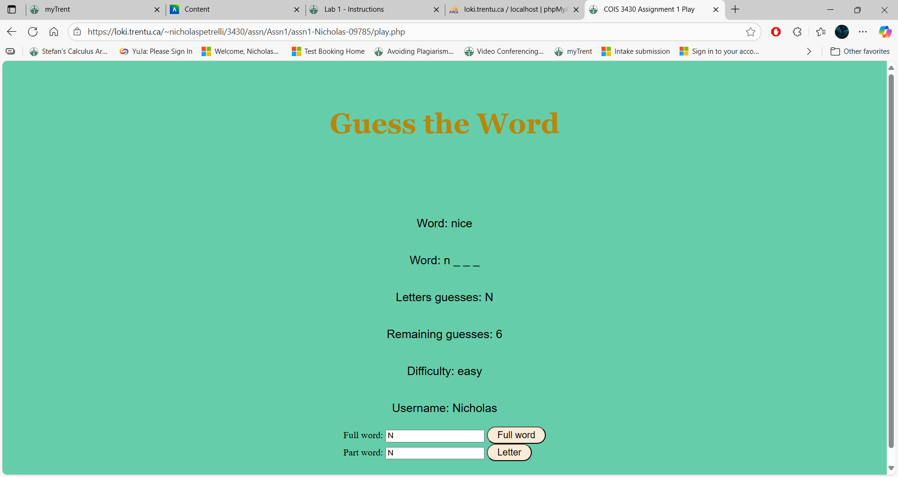